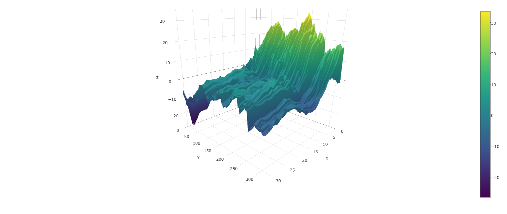

## Decode Human Speech from ECoG Data

Neural decoding seeks to reconstruct sensory stimuli or behaviors based solely on observed neural activity from neural recordings or neuroimaging.  The objective of this competition is to reconstruct audible human speech based upon intracranial electrocorticography (ECoG) data from a single subject.  ECoG is an invasive technology that records electrical activity from electrodes placed directly on the cortical surface of the brain. The electrodes are placed by a neurosurgeon and are typically used to monitor epileptic activity. Of the technologies available to record human neural activity, ECoG has the highest temporal resolution, making it ideal for studying the uniquely human activity of speech. Neural speech decoding is important for understanding how the brain is organized to process speech and is critical for helping those with auditory and speech deficits. 

[Project Log](./ProjectNote.md)

[Final Report](./FinalReport/Report.pdf)

The structure of the project are:

### Directory

[/subdata](./subdata) Contain subsetted data, which have 500 rows of training datasets. This is used for explorotory and prototyping.

[/FinalReport](./FinalReport) Contain file needed to compile report.

[/sound](./sound) Matlab code for reconstructing sound

### Files

[/main.R](./main.R) is the main job file. Batch this file to Research Computer

[/main.py](./main.py) is the equivalent code in python to test performance.

[/SliceData.R](./SliceData.R) objected to slice data to produce content under `\subdata`. It only needed to be ran once.

[/function.R](./function.R) contain all the functions needed.
