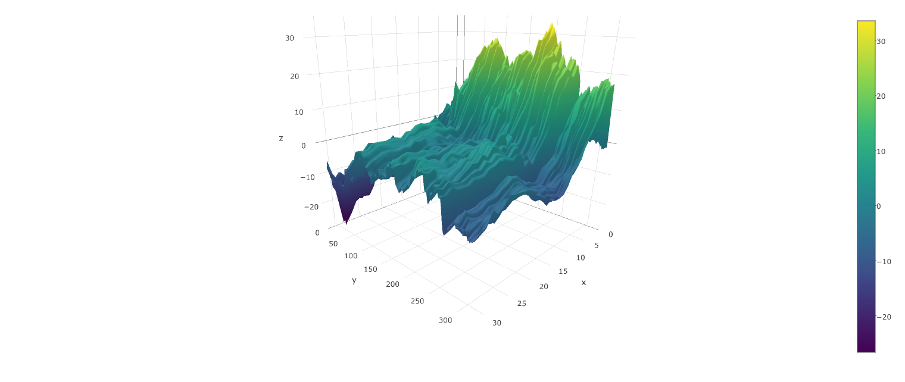

```{r setup, include=FALSE}
knitr::opts_chunk$set(echo = FALSE)
```

## Bagging Models

### Procedures

Repeat b times:

  1. For each sentence calculate correlation to the training sentences
  1. Resampling with replacement weighted by traning sentences
  1. Train models by partition (ideally 5)
  1. Aggregating the prediction by taking means
  
  
  
## Local Models

```{r}
load("./subdata/Ysubdata.RData")
plot(Y.tr.org[1:334,10],type='l',
     xlab="Time",
     ylab="Y")
abline(v=334*c(0.2,0.4,0.6,0.85),col=2)
```

## Predictions

```{r, out.width = "1200px"}

```
